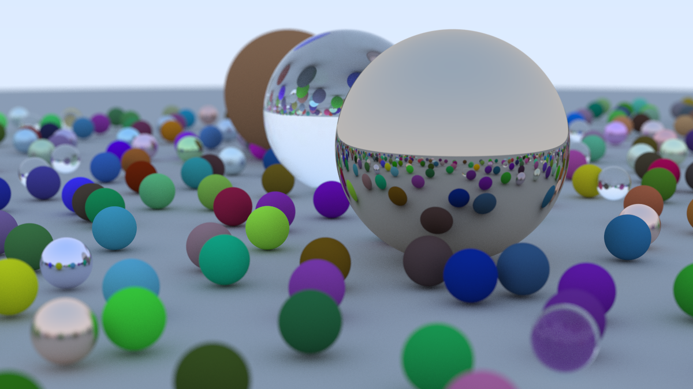

# Raytracer

A CPU path tracer built in C++20, extending the journey started in [**Ray Tracing in One Weekend**](https://raytracing.github.io/) by Peter Shirley and the RTW community. What began as following the book chapter by chapter grew into a multithreaded renderer with the full book trilogy feature set and a few experiments of my own.

> *"The best way to predict the future is to invent it."* — this project is my version of inventing pixels, one random ray at a time.

## Final scene render

The image below is from `renders/final_render_1.ppm` — the capstone **final scene** from *Ray Tracing: The Rest of Your Life* (Book 3), rendered at **1200×675** with multithreading.



*Source: [`renders/final_render_1.ppm`](renders/final_render_1.ppm) (PPM). A PNG preview is included so the image displays on GitHub.*

---

## Features

### From the RTW book series

- **Path tracing** — Monte Carlo integration with recursive `ray_color`
- **Materials** — Lambertian diffuse, metal (with fuzz), dielectric glass (refraction + Schlick reflectance), diffuse lights, and isotropic scattering
- **Textures** — solid colors, checkerboards, Perlin noise, and image textures (`earthmap.jpg`)
- **Hittables** — spheres (stationary and motion-blurred), axis-aligned boxes, quads, and volumes
- **Volumes** — homogeneous fog/smoke via `constant_medium` (Cornell smoke, blue fog, white haze)
- **Transforms** — `translate` and `rotate_y` for placing and orienting geometry
- **Acceleration** — bounding volume hierarchy (BVH) with AABB culling
- **Camera** — adjustable FOV, depth of field (defocus), and motion blur via per-ray time sampling
- **Scenes** — every major scene from Books 1–3, plus a custom Cornell glass variant

### Beyond the book

- **Multithreaded rendering** — row-parallel workers using `std::thread` and atomic work distribution; scales across all CPU cores
- **Progress timing** — logs scanlines remaining and total render time on completion
- **Cornell glass** — Cornell box with a dielectric glass sphere in place of the small box
- **CMake build** — portable C++20 build with automatic asset copying

---

## Build & run

**Requirements:** C++20 compiler (Clang or GCC), CMake 3.16+

```bash
cmake -S . -B build
cmake --build build
./build/raytracer > image.ppm
```

Open the output with any image viewer:

```bash
open image.ppm        # macOS
# or convert to PNG with ImageMagick, GIMP, Preview, etc.
```

Image assets (`images/earthmap.jpg`) are copied into `build/images/` automatically by CMake so texture loading works from the build directory.

### Release build (recommended for long renders)

```bash
cmake -S . -B build -DCMAKE_BUILD_TYPE=Release
cmake --build build
```

---

## Project structure

```
raytracer/
├── main.cpp           # Scene definitions and entry point
├── camera.h           # Camera, rendering loop, path tracing integrator
├── material.h         # BSDFs and scattering
├── texture.h          # Procedural and image textures
├── sphere.h           # Spheres and bounding boxes
├── quad.h             # Quads, boxes, transforms
├── bvh.h / aabb.h     # BVH acceleration structure
├── constant_medium.h  # Participating media (volumes)
├── hittable.h         # Hit records and polymorphic geometry
├── vec3.h / ray.h     # Math primitives
├── images/            # Texture assets
└── renders/           # Saved output images
```

---

## Acknowledgments

This project would not exist without [**Ray Tracing in One Weekend**](https://raytracing.github.io/) and its sequels [*The Next Week*](https://raytracing.github.io/books/RayTracingTheNextWeek.html) and [*The Rest of Your Life*](https://raytracing.github.io/books/RayTracingTheRestOfYourLife.html), by **Peter Shirley** — free, clear, and the best introduction to physically based rendering I know of.

Thanks also to the RTW community for errata, ports, and inspiration, and to **stb_image** (via `stb_image.h`) for lightweight image loading.

If you are reading this and have not worked through the books yet — do it. This repo is a love letter to that series.

---

## License

The RTW book code is in the public domain. See the [official series](https://github.com/RayTracing/raytracing.github.io) for details.
